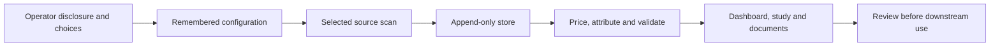

**CompleteTech LLC Skills** · [Start here](ONBOARDING.md) · [Agent instructions](SKILL.md) · [Skill library](https://github.com/CompleteTech-LLC/agentic-services-orchestrator-skill/blob/main/references/skill-family.md) · [Contributing](CONTRIBUTING.md)

# AI Usage Ledger Skill

<p align="center"></p>

Compile recorded AI coding-agent usage into an append-only, de-duplicated, priced and account-attributed ledger, then render dashboards, study packages and ledger documents. Preserve observed evidence, estimates, exclusions and attribution uncertainty separately.

## About

The ledger is the evidence member of the CompleteTech LLC skill family. It supplies usage and cost evidence to discovery, delivery and billing workflows; it does not issue invoices or authorize charging a client. Its activation key is **`ai-usage-ledger`**, not the repository name.

[Onboarding](ONBOARDING.md) separates a safe fixture demonstration from real source onboarding. [BRANDING.md](BRANDING.md) describes presentation and downstream handoffs. The previous full README is preserved byte-for-byte in [REFERENCE.md](REFERENCE.md) for its catalog and examples; use the current **Before You Start** and **Core Workflow** in [SKILL.md](SKILL.md) for consent and operational boundaries. In particular, onboarding does not register a schedule: `schedule install` requires its own operator consent.

## OpenClaw / ClawHub Metadata

| Field | Value |
|---|---|
| Skill key | `ai-usage-ledger` |
| Existing version | `1.5.12` (unchanged by package alignment) |
| Core runtime | `python3`; Python standard library |
| Optional document libraries | See [requirements.txt](requirements.txt) for PDF, DOCX and preview dependencies |
| Repository | `CompleteTech-LLC/ai-usage-ledger-skill` |
| Package contract | [skill-package.json](skill-package.json), schema 1 |

The full GitHub checkout contains the logo and previews. A text-only registry bundle can omit binary assets; the new package validator targets the full checkout. This change does not publish a registry release.

## Quick Start: synthetic inputs only

From a full checkout with Python 3.12, the package CI baseline:

```bash
python tests/make_fixtures.py
python scripts/run_pipeline.py --manifest examples/manifest.fixtures.json
```

The fixture test should print `ALL OK`. The example manifest writes under `tests/out/pipeline`; inspect the artifact paths printed by the pipeline. These commands do not initialize your personal ledger, select remote hosts or install schedules. Re-running can replace earlier test outputs.

For real use, first read the disclosure in [SKILL.md](SKILL.md), confirm the source and retention scope, then follow its `python scripts/ledger.py init`, `run` and `status` workflow. Do not substitute an unattended `init --yes` for informed operator choices.

## Workflow Diagram

Source: [assets/diagrams/workflow.mmd](assets/diagrams/workflow.mmd).



## Examples and reference


[Example dashboard](assets/examples/example.html) · [Example study](assets/examples/example.md) · [Onboarding transcript](assets/examples/example-onboarding.md) · [Full reference](REFERENCE.md)

The committed examples are synthetic. Keep new outputs outside committed preview paths. Use the actual `ledger.py doc --list`, `query --presets` and `archive status` interfaces documented in the specialist instructions; package alignment does not add a new ledger CLI or test-suite runner.

## Branding and handoffs

Reports remain neutral until the operator explicitly chooses branding. Authorized CompleteTech output uses the existing local logo and the [CompleteTech report preset](examples/report_config.completetech.json). During real onboarding, the existing `--brand-preset completetech` option selects that preset. Preserve approved custom settings instead of forcing a company identity on personal reports.

Carry evidence, source coverage, price snapshot, attribution confidence, artifact paths, approved brand and approval status to the next specialist. API-equivalent figures are estimates, not proof of a provider invoice or permission to bill.

## Runtime permissions and network boundary

Read the complete disclosure in [SKILL.md](SKILL.md) before personal onboarding. The skill retains a durable local ledger and chosen output files. Prompt capture, credential-derived account claims, identifiable accounts, raw-log archiving, other profiles/drives, WSL and named SSH hosts are separate opt-ins. Credential tokens and keys must not be retained or published.

SSH operation is not network-free: for explicitly selected hosts, the existing implementation transfers the scanner and retrieves scan outputs using SSH/SCP. Generated pages are self-contained by default; explicitly enabling external resources can cause the viewer's browser to fetch remote resources. The manifest therefore records `operator-selected-hosts`, not a blanket local-only permission grant.

Schedules are never installed by these package checks or the fixture demonstration. The existing `schedule install` requires its separate disclosure and operator confirmation; `schedule remove` removes a registered schedule. Before external sharing, follow the anonymization and `publish-check` workflow and review the result; a passing check is not approval to publish.

## Development and quality

```bash
python -m unittest discover -s tests -p 'test_package_*.py' -v
python scripts/validate_package.py
python scripts/validate_quality.py
```

The first two commands use only the standard library and test the checkout contract. The original Quality command requires its documented development tools and runs its existing parser, store, security, diagram and bundle checks. See [QUALITY.md](QUALITY.md) and [CONTRIBUTING.md](CONTRIBUTING.md). No original test suite is replaced or weakened.

## License

Code, templates and documentation retain the [MIT license](LICENSE). Names, logos, seals and other brand assets remain subject to [BRAND_ASSETS.md](BRAND_ASSETS.md). No private assets or font files are added by this alignment.
