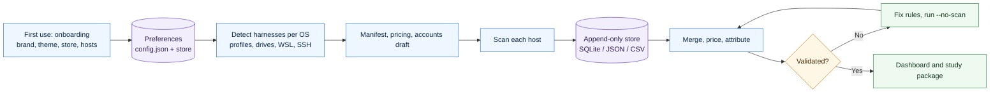

# AI Usage Ledger Skill

<p align="center">
  
</p>

A CompleteTech LLC skill for compiling every locally recorded AI coding-agent call into one priced, account-attributed, validated ledger, kept append-only in SQLite, JSON or CSV, and rendered as a branded light/dark dashboard and a research-grade study package. Onboard once; refresh with one command.

## About

Part of the CompleteTech LLC agentic services skill library. Where the `agentic-*` skills produce client-facing documents, this skill produces the evidence behind them: how much agent work happened, on which accounts, what it would have cost at list price, and what the cache and the subscriptions saved.

## OpenClaw / ClawHub Metadata

- Skill key: `ai-usage-ledger`
- Version-ready metadata: `1.3.0`
- Homepage: https://github.com/CompleteTech-LLC/ai-usage-ledger-skill
- README: https://github.com/CompleteTech-LLC/ai-usage-ledger-skill#readme
- Runtime binaries: `python3`
- Python packages: none at runtime (standard library); `pyyaml==6.0.3` and `ruff==0.14.0` for the quality validator
- Intended registry/discovery tags: `latest`, `complete-tech`, `codex-skill`, `claude-code`, `codex`, `token-usage`, `cost-analysis`, `observability`, `ledger`, `dashboard`
- License: repository code, templates, and documentation use MIT; published by CompleteTech on ClawHub.
- Brand assets: CompleteTech LLC names, logos, seals, and brand assets are reserved; see `BRAND_ASSETS.md`.

## Workflow Diagram

Source: [assets/diagrams/workflow.mmd](assets/diagrams/workflow.mmd).



## What It Does

- Onboards once: brand, theme, storage backend, working directory and timezone are asked on first use (or passed as flags by an agent), stored, and never asked again; `reinit` starts over and keeps the old store.
- Detects harness logs for the running OS automatically: Windows, macOS and Linux default directories, environment overrides, VS Code / Cursor / VSCodium / Windsurf global storage, every WSL distro, other user profiles and drives (same-volume mappings are recognised and skipped), plus SSH hosts you name.
- Keeps an append-only ledger in SQLite, JSON (JSONL) or CSV with stable per-call ids, so re-running never double counts and the history survives the tools' own log retention.
- Finds agent logs on every drive, user profile, WSL distro and SSH host, including old-profile backups.
- Parses Claude Code / Agent SDK, Codex CLI / Desktop / VS Code, GitHub Copilot CLI, Gemini CLI, Qwen Code, opencode, OpenClaw, pi, Cline / Roo Code / Kilo Code, aider, Kimi Code CLI, Mistral Vibe and Continue with dedicated parsers, and any other JSON-logging tool through a generic usage sniffer.
- De-duplicates streamed turns and Codex fork replay (the copy of a parent's history that every spawned thread carries), which otherwise inflates totals by an order of magnitude.
- Prices every call at list API rates by token class, computes cache savings, and compares each subscription account with its API-equivalent using the billing plan Codex stamps on each call.
- Validates against the tools' own counters and states confidence per finding and per attribution rule.
- Renders a themed, brandable dashboard and a dated, checksummed study package with a machine-readable ledger.

## Contents

- `SKILL.md` - operating instructions, validation checks and boundaries.
- `scripts/ledger.py` - `init` / `run` / `status` / `export` / `reinit`: onboarding, remembered preferences, append-only refresh.
- `scripts/detect_hosts.py` - OS-aware discovery of harness roots, profiles, drives, WSL distros and account claims.
- `scripts/ledger_store.py` - the append-only store (SQLite, JSON, CSV) with stable ids, prefs, run history and exports.
- `scripts/run_pipeline.py` - one command from raw logs to the packaged ledger (used by `ledger.py`; works alone with a manifest).
- `scripts/compile_ai_logs.py` - `scan` (14 parsers plus a generic sniffer) and `report` (merge, price, attribute).
- `scripts/analyze_events.py` - distributions, time of day, concentration, validation, sensitivity.
- `scripts/build_dashboard.py`, `scripts/build_report.py` - branded dashboard and study renderers.
- `scripts/validate_quality.py` - lint, parse, diagram, smoke, fixture and ClawHub bundle gates.
- `templates/` - manifest, pricing sheet, account and report-config examples.
- `examples/` - a workstation manifest and the CompleteTech brand preset.
- `references/` - harness and runtime catalog (forty-plus tools), log formats, discovery and account attribution, pitfalls, harness notes.
- `tests/make_fixtures.py` - synthetic logs and totals check for every parser.
- `tests/test_store.py` - backend de-duplication, non-interactive onboarding and a double `ledger.py run` on the fixtures.

## Quick Start

```bash
python3 tests/make_fixtures.py             # must print ALL OK (the pipeline is standard library only)
python3 scripts/ledger.py init             # first use: brand, theme, sqlite/json/csv, hosts and accounts are detected
python3 scripts/ledger.py run              # scan, append new calls, rebuild dashboard and study; repeat any time
python3 scripts/ledger.py status
```

From an agent or CI, skip the prompts: `python3 scripts/ledger.py init --yes --set brand.name=Acme --set store.kind=json`. Preferences live in `~/.ai-usage-ledger/config.json` (override with `AI_USAGE_LEDGER_HOME`); review the generated `accounts.json` there before trusting the per-account tables. `python3 scripts/ledger.py reinit` starts over and keeps the previous store beside the new one.

The manifest-driven route is still available for one-off runs without a store:

```bash
cp examples/manifest.workstation.json manifest.json      # or: python3 scripts/detect_hosts.py --all-profiles --json
cp examples/report_config.completetech.json templates/pricing.json templates/accounts.example.json .
python3 scripts/run_pipeline.py --manifest manifest.json
```

Rendered figures are API-equivalents at list price, not invoices. Attribution rules below high confidence are listed in the study; challenge those first.

## Example


Example files: [Markdown](assets/examples/example.md) · [HTML dashboard](assets/examples/example.html).

**Study: synthetic fixture data across ten tools**

- Ten parsers exercised on generated logs, including a forked Codex thread whose replayed history is dropped.
- Per-account subscription versus API-equivalent, usage-based spend, and cache savings tables.
- Validation, distributions, time-of-day and concentration sections with confidence levels.

Generate it in one command:

```bash
python3 tests/make_fixtures.py
python3 scripts/run_pipeline.py --manifest examples/manifest.fixtures.json
```

The committed example uses synthetic fixture data only; no real account or transcript is included.

## Branding Assets

`assets/logo.png` is the CompleteTech LLC logo used on the dashboard and study headers. `examples/report_config.completetech.json` carries the palette (`#1E3A8A` accent, `#0F172A` ink, `#EEF2FF` soft accent, `#64748B` muted, `#E2E8F0` border, `#F8FAFC` zebra), eyebrow, tagline and footer used across the skill library; onboarding offers these as defaults and stores whatever the operator answers instead. Both pages render in light, dark and system themes with a persisted toggle, starting from the theme chosen at onboarding.

## Brand Notes

Use a direct, concrete, low-hype tone. Present figures as measured evidence with stated confidence: what was scanned, what was excluded, which rules are inferred. Do not present API-equivalents as invoices, do not smooth over corrections, and do not quote vendor dashboards that include replayed history as independent confirmation.

## Runtime Permissions

| Capability | Boundary |
|---|---|
| Files read | Agent transcripts, tool databases and credential files under the operator's own profiles and manifest hosts; bundled templates, references, `assets/logo.png`. |
| Files written | `~/.ai-usage-ledger/` (config, store, generated manifest, accounts, pricing, report config); `scans/`, `compiled/`, `store-export/`, `reports/` under the chosen `workdir`; test fixtures during the test suites. |
| Local commands | `python3` scripts; `wsl.exe -l -q` during detection; `wsl.exe`, `ssh`, `scp` only for hosts in the manifest. |
| Not required | Outbound network access, credential use, persistence, privilege escalation, destructive file operations, background services. |

## License

Code, templates, and documentation are licensed under the MIT License. CompleteTech LLC names, logos, seals, and brand assets are reserved and are not licensed for reuse except to identify this project. See `LICENSE` and `BRAND_ASSETS.md`.

## Network Boundary

This skill is local-only. The scripts make no outbound network calls and post no metadata anywhere; SSH and WSL are reached only for hosts the operator names.
