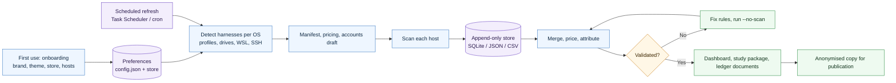
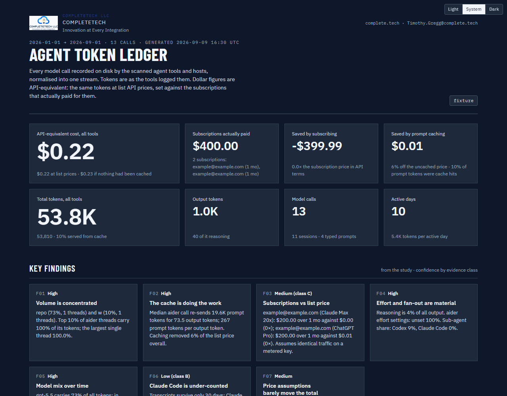
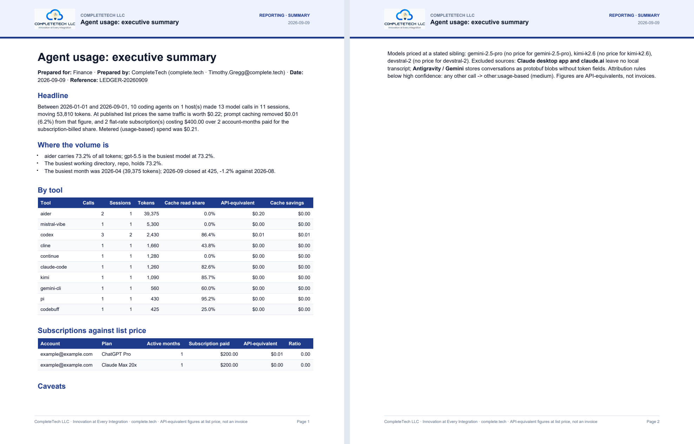

# AI Usage Ledger Skill

<p align="center">
  
</p>

A CompleteTech LLC skill for compiling every locally recorded AI coding-agent call into one priced, account-attributed, validated ledger, kept append-only in SQLite, JSON or CSV, and rendered as a branded light/dark dashboard, a research-grade study package and fifteen ledger documents (statements, memos, briefs, billing evidence) in Markdown, HTML, PDF and DOCX. Onboard once; refresh by hand or on a schedule; keep the raw logs if you want them; anonymise for publication; ask it anything specific afterwards.

## About

Part of the CompleteTech LLC agentic services skill library. Where the `agentic-*` skills produce client-facing documents, this skill produces the evidence behind them: how much agent work happened, on which accounts, what it would have cost at list price, and what the cache and the subscriptions saved.

## OpenClaw / ClawHub Metadata

- Skill key: `ai-usage-ledger`
- Version-ready metadata: `1.5.8`
- Homepage: https://github.com/CompleteTech-LLC/ai-usage-ledger-skill
- README: https://github.com/CompleteTech-LLC/ai-usage-ledger-skill#readme
- Runtime binaries: `python3`
- Python packages: none at runtime (standard library); `pyyaml==6.0.3` and `ruff==0.14.0` for the quality validator; optional `reportlab==4.5.1` and `python-docx==1.2.0` for PDF / DOCX documents (optional PNG preview: `pypdfium2==5.8.0`, `pillow==12.2.0`)
- Intended registry/discovery tags: `latest`, `complete-tech`, `codex-skill`, `claude-code`, `codex`, `token-usage`, `cost-analysis`, `observability`, `ledger`, `dashboard`, `pdf`, `anonymization`
- License: repository code, templates, and documentation use MIT; published by CompleteTech on ClawHub.
- Brand assets: CompleteTech LLC names, logos, seals, and brand assets are reserved; see `BRAND_ASSETS.md`.

## Workflow Diagram

Source: [assets/diagrams/workflow.mmd](assets/diagrams/workflow.mmd).



## What It Does

- Onboards once: brand, theme, storage backend, working directory and timezone are asked on first use (or passed as flags by an agent), stored, and never asked again; `reinit` starts over and keeps the old store.
- Labels usage by account without touching credentials unless asked: per-host placeholders by default, or the account id prefix and plan type from the tools' credential files after an explicit opt-in and a warning, with e-mails and organisation names kept only on request.
- Detects harness logs for the running OS automatically: Windows, macOS and Linux default directories, environment overrides, VS Code / Cursor / VSCodium / Windsurf global storage, every WSL distro, other user profiles and drives (same-volume mappings are recognised and skipped), plus SSH hosts you name.
- Keeps an append-only ledger in SQLite, JSON (JSONL) or CSV with stable per-call ids, so re-running never double counts and the history survives the tools' own log retention.
- Refreshes on a schedule when asked: onboarding offers daily / weekly / monthly and installs a Task Scheduler task or a crontab line that logs to the ledger home.
- Renders fifteen ledger documents from a catalog with a machine-readable index: executive summary, monthly statement, quarterly review, account statement, subscription memo, renewal recommendation, cache brief, budget forecast, project allocation, billing evidence, model mix, tool adoption, host inventory, data-quality note and correction notice, as Markdown, themed HTML, PDF and DOCX.
- Anonymises for publication: salted pseudonyms for hosts, sessions, projects and accounts; paths, prompts and identities removed; a private map kept for the owner.
- Archives the raw log files themselves when asked at onboarding: every file the scanners read, from any tool on any host kind (local, other drive, WSL, SSH), gzip by default, indexed, append-only, with `grep` and `restore`; the transcripts outlive the tools' retention windows.
- Answers detailed questions from the accumulated store: thirty presets (per day, week, month, tool, host, model, project, account, plan, session, prompt text, cache, first and last use), free read-only SQL, and regex search inside the archived logs, with date, tool, host, account, model and project filters and table / CSV / JSON output. Prompt text is stored only after an explicit opt-in (`prompts.capture=y`); by default the ledger keeps counts and tokens, and `query prompts` says so.
- Finds agent logs on every drive, user profile, WSL distro and SSH host, including old-profile backups.
- Parses Claude Code / Agent SDK, Codex CLI / Desktop / VS Code, GitHub Copilot CLI, Gemini CLI, Qwen Code, opencode, OpenClaw, pi, Cline / Roo Code / Kilo Code, aider, Kimi Code CLI, Mistral Vibe and Continue with dedicated parsers, and any other JSON-logging tool through a generic usage sniffer.
- De-duplicates streamed turns and Codex fork replay (the copy of a parent's history that every spawned thread carries), which otherwise inflates totals by an order of magnitude.
- Prices every call at list API rates by token class, computes cache savings, and compares each subscription account with its API-equivalent using the billing plan Codex stamps on each call.
- Validates against the tools' own counters and states confidence per finding and per attribution rule.
- Renders a themed, brandable dashboard and a dated, checksummed study package with a machine-readable ledger.

## Contents

- `SKILL.md` - operating instructions, validation checks and boundaries.
- `scripts/ledger.py` - `init` / `run` / `status` / `export` / `reinit`: onboarding, remembered preferences, append-only refresh.
- `scripts/detect_hosts.py` - OS-aware discovery of harness roots, profiles, drives, WSL distros and account claims.
- `scripts/ledger_store.py` - the append-only store (SQLite, JSON, CSV) with stable ids, prefs, run history and exports.
- `scripts/run_pipeline.py` - one command from raw logs to the packaged ledger (used by `ledger.py`; works alone with a manifest).
- `scripts/render_ledger_doc.py`, `scripts/render_pdf.py` - the document template system: catalog listing, placeholder filling from the ledger, Markdown / HTML / PDF / DOCX output.
- `scripts/anonymize.py` - pseudonymise a ledger for publication.
- `scripts/schedule.py` - Task Scheduler / cron entry for the scheduled refresh.
- `scripts/ledger_archive.py` - raw-log archive (status, list, grep, restore).
- `scripts/ledger_query.py` - the question layer over the store and the archive.
- `scripts/compile_ai_logs.py` - `scan` (14 parsers plus a generic sniffer) and `report` (merge, price, attribute).
- `scripts/analyze_events.py` - distributions, time of day, concentration, validation, sensitivity.
- `scripts/build_dashboard.py`, `scripts/build_report.py` - branded dashboard and study renderers.
- `scripts/validate_quality.py` - lint, parse, diagram, smoke, fixture and ClawHub bundle gates.
- `templates/` - manifest, pricing sheet, account and report-config examples.
- `examples/` - a workstation manifest and the CompleteTech brand preset.
- `references/` - harness and runtime catalog (forty-plus tools), log formats, discovery and account attribution, pitfalls, harness notes, the ledger document catalog and its `template-index.json`.
- `requirements.txt` - quality-validator dependencies plus the optional libraries for branded PDF / DOCX rendering.
- `tests/make_fixtures.py` - synthetic logs and totals check for every parser.
- `tests/test_store.py` - backend de-duplication, non-interactive onboarding and a double `ledger.py run` on the fixtures.

## Quick Start

```bash
python3 tests/make_fixtures.py             # must print ALL OK (the pipeline is standard library only)
python3 scripts/ledger.py init             # first use: brand, theme, sqlite/json/csv, hosts and accounts are detected
python3 scripts/ledger.py run              # scan, append new calls, rebuild dashboard and study; repeat any time
python3 scripts/ledger.py status
python3 scripts/ledger.py doc --list       # ledger documents; render one with --template <id> [--pdf --docx]
python3 scripts/ledger.py run --anonymize  # publishable copy under <workdir>/anonymized/
python3 scripts/ledger.py schedule status  # the scheduled refresh chosen at onboarding
python3 scripts/ledger.py query --presets  # then e.g. query by-project --since 2026-08-01 --tool codex
python3 scripts/ledger.py archive status   # the raw-log archive, if enabled at onboarding
```

From an agent or CI, skip the prompts: `python3 scripts/ledger.py init --yes --set brand.name=Acme --set store.kind=json`. Preferences live in `~/.ai-usage-ledger/config.json` (override with `AI_USAGE_LEDGER_HOME`); review the generated `accounts.json` there before trusting the per-account tables. `python3 scripts/ledger.py reinit` starts over and keeps the previous store beside the new one.

The manifest-driven route is still available for one-off runs without a store:

```bash
cp examples/manifest.workstation.json manifest.json      # or: python3 scripts/detect_hosts.py --all-profiles --json
cp examples/report_config.completetech.json templates/pricing.json templates/accounts.example.json .
python3 scripts/run_pipeline.py --manifest manifest.json
```

Rendered figures are API-equivalents at list price, not invoices. Attribution rules below high confidence are listed in the study; challenge those first.

## Example



Example files: [Onboarding transcript](assets/examples/example-onboarding.md) · [Study (Markdown)](assets/examples/example.md) · [HTML dashboard](assets/examples/example.html) · [HTML study](assets/examples/example-study.html) · [Executive summary Markdown](assets/examples/example-executive-summary.md) · [PDF](assets/examples/example.pdf) · [DOCX](assets/examples/example.docx) · [Document preview](assets/examples/example-document.png)

**Study and executive summary: synthetic fixture data across ten tools**

- Ten parsers exercised on generated logs, including a forked Codex thread whose replayed history is dropped.
- Per-account subscription versus API-equivalent, usage-based spend, and cache savings tables.
- Validation, distributions, time-of-day and concentration sections with confidence levels.
- The executive summary document rendered from the same ledger with the CompleteTech letterhead, in PDF and DOCX.
- A first-run onboarding transcript (`example-onboarding.md`) showing every question, the detection output and the saved preferences, generated by `tests/make_onboarding_example.py` on a synthetic machine.



Generate them:

```bash
python3 tests/make_fixtures.py
python3 scripts/run_pipeline.py --manifest examples/manifest.fixtures.json
python3 scripts/render_ledger_doc.py --template executive-summary \
  --compiled tests/out/pipeline/compiled --report-config examples/report_config.completetech.json \
  --var prepared_for="Finance" --out assets/examples/example-executive-summary.md --pdf --docx --png   # then rename to example.pdf / example.docx / example-document.png
```

The committed examples use synthetic fixture data only; no real account or transcript is included.

## Branding Assets

`assets/logo.png` is the CompleteTech LLC logo used on the dashboard and study headers, on the HTML band of every ledger document, and in the PDF / DOCX letterhead, whenever the `completetech` preset is selected. Out of the box the skill renders neutral, unbranded pages. `examples/report_config.completetech.json` carries the palette (`#1E3A8A` accent, `#0F172A` ink, `#EEF2FF` soft accent, `#64748B` muted, `#E2E8F0` border, `#F8FAFC` zebra), eyebrow, tagline and footer used across the skill library; onboarding offers these as defaults and stores whatever the operator answers instead. Both pages render in light, dark and system themes with a persisted toggle, starting from the theme chosen at onboarding. They are self-contained: the logo is inlined, fonts fall back to locally installed faces or the system stack, and nothing is fetched from the network.

## Data Collected

- Read: agent transcripts, session logs and the tools' own counters and databases in your own profile (`~/.claude`, `~/.codex`, `~/.copilot`, IDE `globalStorage` and the other roots in `references/harness-catalog.md`); other profiles and drives, WSL distros and SSH hosts only when you enable `detect.all_profiles` / `detect.wsl` or name the host, and only where you own the data or are authorised to audit it. Nothing is modified and nothing needs elevation.
- Kept: an append-only ledger of per-call metadata (timestamps, models, token counts, list prices, host, project path, session id, pseudonymous account) in `~/.ai-usage-ledger/` (owner-only) plus the generated tables, dashboard, study package and documents under your working directory. Nothing is transmitted; the scripts make no network calls.
- Opt-in only: prompt text (`prompts.capture`), credential-file claims for account ids and plan types (`accounts.from_credentials`), e-mails and organisation names (`accounts.identifiable`), a copy of the raw log files (`archive.raw_logs`), and a scheduled refresh (`schedule install`, with its own typed consent). All default off.
- Sharing: build the anonymised copy (`ledger.py run --anonymize`, `doc --anonymize`) and run `ledger.py publish-check <dir>` before anything leaves the machine; it flags e-mails, account ids, organisation and host names and credential references.
- Removal: `ledger.py schedule remove`, then delete `~/.ai-usage-ledger/` and the generated directories under the working directory; `ledger.py reinit` starts a fresh configuration and keeps the previous store beside it. The full operator disclosure the agent relays before onboarding is the **Before You Start** table in `SKILL.md`.

## Security Model

- Configuration files (manifest, config, accounts, pricing, report config) are trusted input that names hosts to reach and text to render; keep them owner-writable (the scripts warn otherwise).
- No shell is ever handed a string: local commands are argument lists, the CSV merge sort is Python, and every word sent to an SSH or WSL shell is validated against a strict grammar and quoted (`scripts/safety.py`).
- Persistence is never registered by onboarding or by a configuration key: `schedule install` shows the wrapper, the hosts and roots it will read, the archive and anonymise flags, the output directories and the storage used so far, then needs a typed confirmation (a second one for high-impact schedules) or an operator-written consent record tied to a hash of that exact configuration; `--expires` makes the entry remove itself; `schedule remove` is printed everywhere it matters.
- The scheduler wrapper carries fixed flags only, is written with mode 0700 on POSIX, and its contents are printed before anything is registered.
- Branding is HTML-escaped and validated; logos are inlined from local files; generated pages carry a Content-Security-Policy and load nothing from the network unless `allow_external_resources` is set.
- Reports are neutral unless the operator chooses branding (a preset must be selected explicitly); an unconfigured `run` refuses rather than onboarding with defaults.
- Everything the ledger keeps about its owner (config, store, archive, logs, anonymisation map) is created owner-only, and a config file others can edit is refused.
- The raw-log archive validates host names and source paths, keeps every destination inside its root, and reaches SSH hosts with fixed commands fed a NUL-delimited file list.
- Credential files are opened only when the operator opts in at onboarding, after a warning that names the files and fields; only the claims needed for attribution and pricing are kept, pseudonymously unless identifiable output is requested. `accounts.json` stays owner-only and out of study packages unless asked, and `ledger.py publish-check` scans anything about to be shared for e-mails, account ids, organisation names, host names and credential references.
- `tests/test_security.py` keeps these properties under regression; the ClawHub audit findings for 1.5.0 and 1.5.1 are addressed in 1.5.1 and 1.5.2.

## Brand Notes

Use a direct, concrete, low-hype tone. Present figures as measured evidence with stated confidence: what was scanned, what was excluded, which rules are inferred. Do not present API-equivalents as invoices, do not smooth over corrections, and do not quote vendor dashboards that include replayed history as independent confirmation.

## Runtime Permissions

| Capability | Boundary |
|---|---|
| Files read | Agent transcripts, tool databases and credential files under the operator's own profiles and manifest hosts; bundled templates, references, `assets/logo.png`. |
| Files written | `~/.ai-usage-ledger/` (config, store, generated manifest, accounts, pricing, report config, private anonymisation map, scheduler wrapper and logs, and the raw-log archive when enabled); `scans/`, `compiled/`, `store-export/`, `reports/`, `anonymized/`, `documents/` under the chosen `workdir`; test fixtures during the test suites. |
| Local commands | `python3` scripts; `wsl.exe -l -q` during detection; `wsl.exe`, `ssh`, `scp` only for hosts in the manifest; `schtasks` / `crontab` only for `schedule install|remove`. |
| Not required | Outbound network access, credential use, persistence, privilege escalation, destructive file operations, background services. |

## License

Code, templates, and documentation are licensed under the MIT License. CompleteTech LLC names, logos, seals, and brand assets are reserved and are not licensed for reuse except to identify this project. See `LICENSE` and `BRAND_ASSETS.md`.

## Network Boundary

This skill is local-only. The scripts make no outbound network calls and post no metadata anywhere; SSH and WSL are reached only for hosts the operator names. Generated pages are self-contained and carry a `Content-Security-Policy` that forbids network loads; only if the operator sets `branding.allow_external_resources: true` can a rendered page reference a remote logo or Google Fonts stylesheet, which the viewer's browser then fetches.
